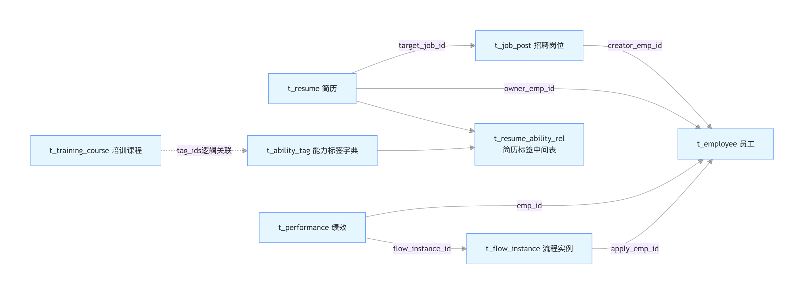

# HR‑Agent 业务数据库设计文档
> 文件：`HR‑Agent数据库设计.md`
> 版本：V1.0
> 数据库：MySQL5.7（Docker容器 douban‑mysql，端口13306）
> 库名：`hr_agent_db`
> 说明：业务表共8张；Flowable流程引擎act_*系列表由框架自动生成，不包含在本DDL内；无数据库外键，应用层做关联；统一逻辑删除。

## 目录
1. [环境说明](#1-环境说明)
2. [通用字段规范](#2-通用字段规范)
3. [ER模型说明](#3-er模型说明)
4. [数据表详细设计](#4-数据表详细设计)
5. [DDL建表语句](#5-ddl建表语句)
6. [yml配置参考](#6-yml配置参考)

## 1. 环境说明
| 组件 | 容器名称 | 宿主机端口 | 说明 |
|---|---|---|---|
| MySQL5.7 | douban‑mysql | 13306 | 业务数据库 |
| Redis6.2 | douban‑redis | 16379 | 缓存 |
| RabbitMQ3.8 | douban‑rabbitmq | 15672(amqp) /15673(管理页) | 消息队列 |
| Elasticsearch7.17.9 | es | 9200 | 检索存储JD向量文档 |

- MySQL账号：root / Admin@888888
- 字符集：`utf8mb4`，排序规则：`utf8mb4_unicode_ci`
- Flowable配置：`database‑schema‑update: true`，启动自动生成act_*流程表；history‑level:full

## 2. 通用字段规范
所有业务表统一包含以下字段：

| 字段 | 类型 | 说明 |
|---|---|---|
| id | bigint unsigned auto_increment | 主键 |
| create_time | datetime(3) | 创建时间，默认当前时间戳 |
| update_time | datetime(3) | 更新时间，自动on update |
| delete_time | datetime(3) | 删除时间，逻辑删除时间戳 |
| is_deleted | tinyint | 0未删除；1已删除，逻辑删除标记 |

> 敏感字段（手机号、身份证、基本工资）：**应用层AES‑256‑CBC加密存储，数据库只存密文**。
> 不使用数据库外键约束，所有关联关系由应用层维护。

## 3. ER模型说明
### 实体关系
1. **t_resume（简历）**
    - target_job_id → t_job_post.id：简历投递岗位
    - owner_emp_id → t_employee.id：负责HR
    - 多对多：t_resume ↔ t_ability_tag，中间表 `t_resume_ability_rel`

2. **t_job_post（岗位）**
    - creator_emp_id → t_employee.id：创建该岗位的HR

3. **t_employee（员工）**
    - 员工作为主体：绩效、流程申请人、岗位创建人、简历负责人

4. **t_performance（绩效）**
    - emp_id → t_employee.id：所属员工
    - flow_instance_id → t_flow_instance.id：关联审批流程

5. **t_flow_instance（流程实例）**
    - apply_emp_id → t_employee.id：流程申请人
    - biz_id + flow_type：动态关联不同业务主键（员工/绩效等）
    - flowable_proc_inst_id：绑定Flowable原生流程实例ID

6. **t_ability_tag（能力标签字典）**
    - 通过中间表`t_resume_ability_rel`绑定简历；培训课程冗余tag_ids做快速匹配

7. **t_training_course（培训课程）**
    - tag_ids逗号分隔标签ID，用于按能力标签匹配推荐课程

