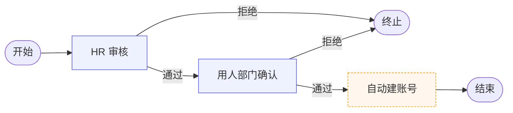
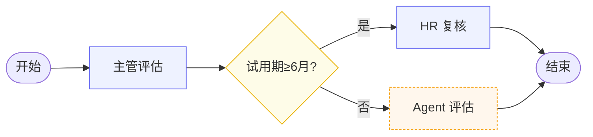
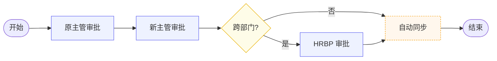
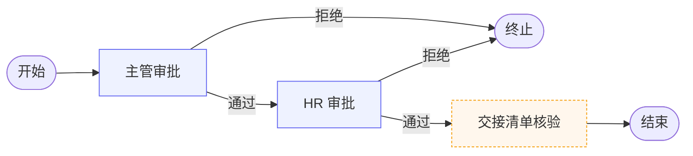

# HRAgent Flowable 工作流引擎集成与流程模型设计文档

| 项 | 值 |
|---|---|
| 文档版本 | v1.0 |
| 项目 | hragent |
| 引擎 | Flowable 7.0.1 |
| 框架 | Spring Boot 3.3.4 / Java 17 / MyBatis-Plus 3.5.7 |
| 适用角色 | 项目经理 / 后端 / 测试 / 运维 |
| 验收标准 | 4 套流程模型可正常部署，流程可正常发起与流转 |

---

## 目录

1. [项目概述](#1-项目概述)
2. [总体架构设计](#2-总体架构设计)
3. [Flowable 引擎集成设计](#3-flowable-引擎集成设计)
4. [流程模型设计](#4-流程模型设计)
5. [审批人规则设计](#5-审批人规则设计)
6. [Agent 触发入口设计](#6-agent-触发入口设计)
7. [接口设计](#7-接口设计)
8. [数据库设计](#8-数据库设计)
9. [实施计划](#9-实施计划)
10. [验收标准](#10-验收标准)

---

## 1. 项目概述

### 1.1 项目背景

HRAgent 系统当前已具备员工、岗位、简历、绩效、培训等基础人事数据 CRUD 能力，并集成了 Redis 分布式锁、限流、防重提交等横切能力。但所有人事动作（入职、转正、调岗、离职）仍以单表状态字段表达，缺少审批链路、节点留痕、条件分支与自动化能力。

引入 Flowable 7.x 工作流引擎，构建可配置、可审计、可扩展的人事审批底座，并预留 AI Agent 触发入口，为后续自动化人事决策铺路。

### 1.2 目标

| 目标 | 描述 |
|---|---|
| 引擎集成 | Flowable 7.x 与 Spring Boot、事务、权限完成适配 |
| 流程建模 | 入职、转正、调岗、离职 4 套标准 BPMN 模型 |
| 节点规范 | 配置流程节点、审批人规则、条件分支、自动节点 |
| Agent 入口 | 在自动节点预留 Agent 触发接口，便于后续接入 AI |
| 可验收 | 流程模型可正常部署，流程可正常发起与流转 |

### 1.3 现状评估

| 项 | 现状 | 缺口 |
|---|---|---|
| Flowable 依赖 | 已引入 `flowable-spring-boot-starter-process:7.0.1` | 无配置类、无 BPMN 模型 |
| application.yaml | 已配置 `flowable.database-schema-update=true`、`history-level=full` | `async-executor-activate=false`，自动节点需开启 |
| 业务实体 | `FlowInstance` 实体已存在（flowNo / flowType / bizId / flowableProcInstId） | 无 Service / Controller，无审批任务表 |
| BPMN 资源 | `resources/bpmn/leave.bpmn.xml`（请假示例） | 4 套标准流程模型缺失 |
| 权限 | 自研 AOP 注解（@RateLimit / @DistributedLock / @RepeatSubmit） | 无流程操作权限模型 |
| 事务 | Spring 声明式事务 | Flowable 引擎事务与业务事务需统一 |

### 1.4 范围与交付物

**交付物清单**

1. Flowable 引擎集成配置（`FlowableConfig`、`ProcessEngineConfigurationConfigurer`）
2. 4 套 BPMN 流程模型文件（`onboard.bpmn20.xml` / `regular.bpmn20.xml` / `transfer.bpmn20.xml` / `leave-hr.bpmn20.xml`）
3. 流程编排服务层（`FlowOrchestrator`、`AssigneeResolver`、`AgentTriggerEntry`）
4. 流程 Controller（`FlowProcessController`、`FlowTaskController`、`FlowQueryController`）
5. 数据库 DDL（Flowable 标准表 + 业务扩展表）
6. 接口文档（OpenAPI 风格）

**不在本次范围**

- 流程设计器前端（Flowable Modeler）
- 跨系统消息驱动（MQ 触发流程）
- 多租户隔离
- AI Agent 实际实现（仅预留入口）

---

## 2. 总体架构设计

### 2.1 架构原则

| 原则 | 说明 |
|---|---|
| 引擎与业务解耦 | Flowable API 不直接暴露给 Controller，统一经 `FlowOrchestrator` 桥接 |
| 单数据源单事务 | Flowable 与业务表共用 MySQL 数据源，事务由 Spring 统一管理 |
| 配置即流程 | 流程节点、审批人、条件表达式集中在 BPMN 中，业务代码只读不写流程定义 |
| 自动节点可插拔 | 自动节点统一走 `AgentTriggerEntry`，后续 AI 接入无需改流程 |
| 留痕可审计 | `history-level=full`，所有任务、变量、表单均归档 |

### 2.2 系统架构图

```
┌─────────────────────────────────────────────────────────────────┐
│                       应用层 · CONTROLLER                        │
│  FlowProcessController   FlowTaskController   FlowQueryController │
└────────────┬────────────────────┬───────────────────┬────────────┘
             │                    │                   │
┌────────────▼────────────────────▼───────────────────▼────────────┐
│                    业务编排层 · SERVICE                            │
│  FlowOrchestrator     AssigneeResolver     AgentTriggerEntry ★    │
│  (业务↔引擎桥接)       (审批人规则)         (AI 自动节点触发口)    │
└────────────┬────────────────────┬───────────────────┬────────────┘
             │                    │                   │
┌────────────▼────────────────────▼───────────────────▼────────────┐
│                  引擎层 · FLOWABLE 7.x                            │
│ RepositoryService  RuntimeService  TaskService  HistoryService    │
│   (流程定义部署)     (实例/变量)      (任务/签收)    (归档/审计)    │
└────────────┬────────────────────┬───────────────────┬────────────┘
             │                    │                   │
┌────────────▼────────────────────▼───────────────────▼────────────┐
│              横切关注点 · SPRING BOOT 3.3                          │
│ SpringTxManager   AOP切面(锁/限流/防重)   权限适配   Listener      │
└────────────┬────────────────────────────────────┬────────────────┘
             │                                     │
┌────────────▼────────────────────────────────────▼────────────────┐
│                      数据层 · MYSQL                              │
│  ACT_RE/RU/HI/GE (Flowable标准表)   t_flow_instance/t_employee   │
└──────────────────────────────────────────────────────────────────┘
```

### 2.3 分层职责

| 层 | 职责 | 关键组件 |
|---|---|---|
| 应用层 | 接收 HTTP 请求，参数校验，返回 VO | `FlowProcessController` / `FlowTaskController` / `FlowQueryController` |
| 业务编排层 | 流程发起、审批人解析、自动节点触发 | `FlowOrchestrator` / `AssigneeResolver` / `AgentTriggerEntry` |
| 引擎层 | Flowable 原生服务，封装流程定义/实例/任务/历史 | `RepositoryService` / `RuntimeService` / `TaskService` / `HistoryService` |
| 横切层 | 事务、AOP、权限、节点扩展 | `SpringTxManager` / `@DistributedLock` / `TaskListener` |
| 数据层 | Flowable 标准表 + 业务表 | `ACT_*` / `t_flow_instance` / `t_employee` |

### 2.4 技术选型

| 维度 | 选型 | 理由 |
|---|---|---|
| 引擎 | Flowable 7.0.1 | Spring Boot 3.x 适配、社区活跃、BPMN 2.0 标准 |
| 数据库 | MySQL 8.x | 与现有数据源一致，单数据源单事务 |
| 事务 | Spring `DataSourceTransactionManager` | Flowable 自动加入 Spring 事务管理器 |
| 鉴权 | 自研 `Employee` 角色映射 | 不引入 Spring Security，复用现有 AOP 注解 |
| 历史 | `history-level=full` | 满足审计要求，可追溯变量与表单 |
| 异步 | `async-executor-activate=true` | 自动节点（ServiceTask）异步执行 |

---

## 3. Flowable 引擎集成设计

### 3.1 依赖与版本

`pom.xml` 已引入（无需改动）：

```xml
<dependency>
    <groupId>org.flowable</groupId>
    <artifactId>flowable-spring-boot-starter-process</artifactId>
    <version>7.0.1</version>
</dependency>
```

### 3.2 引擎配置类

新增 `config/FlowableConfig.java`：

```java
package org.example.hragent.config;

import org.flowable.common.engine.impl.engine.EngineConfigurationConstants;
import org.flowable.engine.impl.cfg.ProcessEngineConfigurationImpl;
import org.flowable.spring.SpringProcessEngineConfiguration;
import org.flowable.spring.boot.EngineConfigurationConfigurer;
import org.springframework.context.annotation.Bean;
import org.springframework.context.annotation.Configuration;

/**
 * Flowable 引擎配置
 * - 复用 Spring 事务管理器（单数据源单事务）
 * - 开启异步执行器（自动节点异步触发）
 * - 自定义字体避免中文乱码
 * - 关闭引擎内置鉴权，由应用层 AOP 控制
 */
@Configuration
public class FlowableConfig {

    @Bean
    public EngineConfigurationConfigurer<SpringProcessEngineConfiguration> flowableConfigurer() {
        return configuration -> {
            // 异步执行器：自动节点（ServiceTask）异步触发
            configuration.setAsyncExecutorActivate(true);
            // 历史归档保留 180 天
            configuration.setHistoryTimeToLive("P180D");
            // 关闭引擎自带鉴权，统一走应用层 @DistributedLock / @RateLimit / 权限注解
            configuration.setDisableCallActivityInterceptor(false);
        };
    }
}
```

`application.yaml` 调整：

```yaml
flowable:
  database-schema-update: true          # 启动自动建表/升级
  history-level: full                    # 完整历史，便于审计
  async-executor-activate: true          # ★ 自动节点异步触发（原 false）
  process-definition-cache-limit: 100
  # 数据库表前缀保持默认 ACT_
```

### 3.3 事务适配

Flowable Spring Boot Starter 默认将 `ProcessEngine` 纳入 Spring 事务管理器。关键约束：

| 约束 | 说明 |
|---|---|
| 单数据源 | Flowable 与业务表共用同一 `DataSource`，禁止配置第二数据源 |
| 事务传播 | 业务方法 `@Transactional` 包裹流程操作，保证「业务表写入 + 流程实例创建」原子性 |
| 异常回滚 | 流程引擎抛出 `FlowableException` 时，Spring 事务回滚业务表 |
| 异步边界 | `ServiceTask`（自动节点）异步执行，不在主事务内，需用 `@Transactional(propagation=REQUIRES_NEW)` |

### 3.4 权限适配

不引入 Spring Security，复用现有自研体系：

| 权限点 | 实现 |
|---|---|
| 接口限流 | `@RateLimit`（Redis INCR + TTL，5 次/3 秒） |
| 防重提交 | `@RepeatSubmit`（Redis SETNX，3 秒 TTL） |
| 分布式锁 | `@DistributedLock`（Redisson RLock，SpEL key） |
| 操作鉴权 | Controller 内 `EmployeeService` 校验当前用户角色 |
| 任务签收权限 | `TaskService.claim()` 由 Flowable 内置校验 |

### 3.5 历史与归档

| 配置 | 值 | 说明 |
|---|---|---|
| `history-level` | `full` | 保留所有任务、变量、表单、注释 |
| `historyTimeToLive` | `P180D` | 180 天后异步清理 |
| 归档查询 | `HistoryService` | 通过 `createHistoricProcessInstanceQuery()` 查询 |

---

## 4. 流程模型设计

### 4.1 模型总览

| 流程 | 文件 | processKey | 触发方 | 关键节点 |
|---|---|---|---|---|
| 入职 | `onboard.bpmn20.xml` | `onboard-process` | HR | HR审核 → 用人部门确认 → 自动建账号(Agent) |
| 转正 | `regular.bpmn20.xml` | `regular-process` | 系统/HR | 主管评估 → 条件网关(试用期≥6月?) → HR复核 或 Agent评估 |
| 调岗 | `transfer.bpmn20.xml` | `transfer-process` | 主管 | 原主管 → 新主管 → 条件网关(跨部门?) → HRBP审 → 自动同步(Agent) |
| 离职 | `leave-hr.bpmn20.xml` | `leave-process` | 员工 | 主管审批 → HR审批 → 自动交接清单核验(Agent) |

**命名规范**

- 文件：`<biz>.bpmn20.xml`，放于 `src/main/resources/processes/`
- processKey：`<biz>-process`，全小写连字符
- 节点 ID：`<biz>_<seq>_<role>`，如 `onboard_1_hr_audit`
- 审批人变量：`${approver_<role>}`，由 `AssigneeResolver` 预填

### 4.2 入职流程 onboard-process



**节点定义**

| 节点 ID | 类型 | 审批人/处理方 | 说明 |
|---|---|---|---|
| `onboard_start` | startEvent | - | HR 发起，业务变量：`empId`, `positionId` |
| `onboard_1_hr_audit` | userTask | `${approver_hr}` | HR 审核入职资料 |
| `onboard_2_dept_confirm` | userTask | `${approver_dept_leader}` | 用人部门确认到岗 |
| `onboard_3_create_account` | serviceTask | `agentTriggerDelegate` | Agent 自动创建账号/工号 |
| `onboard_end` | endEvent | - | 同步业务表 `t_employee.status=在职` |

**条件分支**：无（顺序流）

**自动节点**：`onboard_3_create_account` 调用 `AgentTriggerEntry.trigger("CREATE_ACCOUNT", bizId)`

### 4.3 转正流程 regular-process



**节点定义**

| 节点 ID | 类型 | 审批人/处理方 | 说明 |
|---|---|---|---|
| `regular_start` | startEvent | - | 试用期到期触发，变量：`empId`, `probationMonths` |
| `regular_1_leader_eval` | userTask | `${approver_leader}` | 直属上级评估 |
| `regular_gw_months` | exclusiveGateway | - | 条件：`${probationMonths >= 6}` |
| `regular_2_hr_review` | userTask | `${approver_hr}` | 试用期≥6月需 HR 复核 |
| `regular_3_agent_eval` | serviceTask | `agentTriggerDelegate` | 试用期<6月走 Agent 评估 |
| `regular_end` | endEvent | - | 同步 `t_employee.status=正式` |

**条件表达式**：网关分支 `${probationMonths >= 6}` 走 HR 复核，否则走 Agent

### 4.4 调岗流程 transfer-process



**节点定义**

| 节点 ID | 类型 | 审批人/处理方 | 说明 |
|---|---|---|---|
| `transfer_start` | startEvent | - | 主管发起，变量：`empId`, `fromDeptId`, `toDeptId` |
| `transfer_1_old_leader` | userTask | `${approver_old_leader}` | 原部门主管审批 |
| `transfer_2_new_leader` | userTask | `${approver_new_leader}` | 新部门主管审批 |
| `transfer_gw_cross_dept` | exclusiveGateway | - | 条件：`${fromDeptId != toDeptId}` |
| `transfer_3_hrbp` | userTask | `${approver_hrbp}` | 跨部门需 HRBP 审批 |
| `transfer_4_sync` | serviceTask | `agentTriggerDelegate` | Agent 同步组织架构 |
| `transfer_end` | endEvent | - | 同步 `t_employee.dept_id` |

### 4.5 离职流程 leave-process



**节点定义**

| 节点 ID | 类型 | 审批人/处理方 | 说明 |
|---|---|---|---|
| `leave_start` | startEvent | - | 员工发起，变量：`empId`, `reason` |
| `leave_1_leader` | userTask | `${approver_leader}` | 直属上级审批 |
| `leave_2_hr` | userTask | `${approver_hr}` | HR 审批 + 离职面谈安排 |
| `leave_3_handover` | serviceTask | `agentTriggerDelegate` | Agent 核验交接清单完整性 |
| `leave_end` | endEvent | - | 同步 `t_employee.status=离职` |

### 4.6 通用节点规范

| 节点类型 | 规范 |
|---|---|
| startEvent | 必填业务变量 `bizId`, `applyEmpId`；写 `flowType` |
| userTask | `assignee` 或 `candidateGroups` 二选一；附 `taskListeners`（create 事件通知） |
| serviceTask | `flowable:type="agentTriggerDelegate"`；`delegateExpression="${agentTriggerDelegate}"` |
| exclusiveGateway | 必填 `default` 默认分支；条件用 `${}` 表达式 |
| endEvent | 终止态写回 `t_flow_instance.flowStatus` |

---

## 5. 审批人规则设计

### 5.1 规则总览

审批人不写死在 BPMN，统一由 `AssigneeResolver` 在流程发起时根据业务上下文预填到流程变量。

| 角色变量 | 解析规则 | 数据来源 |
|---|---|---|
| `${approver_hr}` | HR 部门负责人 | `t_employee` 角色=`HR` |
| `${approver_leader}` | 申请人直属上级 | `t_employee.leader_id` |
| `${approver_dept_leader}` | 用人部门负责人 | `t_employee` 部门=目标岗位部门且角色=`DEPT_LEADER` |
| `${approver_old_leader}` | 原部门主管 | 申请人当前 `dept_id` 的负责人 |
| `${approver_new_leader}` | 新部门主管 | 目标 `toDeptId` 的负责人 |
| `${approver_hrbp}` | HRBP | `t_employee` 角色=`HRBP` 且支持部门=目标部门 |

### 5.2 角色枚举

`t_employee.role` 字段（建议新增）：

| 值 | 含义 | 权限范围 |
|---|---|---|
| `EMPLOYEE` | 普通员工 | 发起自己的流程 |
| `DEPT_LEADER` | 部门主管 | 审批本部门流程 |
| `HR` | 人事专员 | 审批 HR 节点 |
| `HRBP` | 业务伙伴 | 审批跨部门调岗 |
| `ADMIN` | 系统管理员 | 部署流程、查看所有 |

### 5.3 动态指派

`AssigneeResolver` 接口：

```java
public interface AssigneeResolver {
    /** 根据流程类型与业务上下文，返回所有审批人变量 */
    Map<String, String> resolve(String processKey, Long bizId, Long applyEmpId);
}
```

实现要点：

1. 查 `t_employee` 拿申请人当前部门、岗位、直属上级
2. 查 `t_job_post`（调岗/入职）拿目标部门
3. 查 `t_employee` 按角色 + 部门筛选审批人
4. 结果写入流程变量 `approver_xxx`
5. 找不到审批人时抛 `BusinessException(ErrorCode.APPROVER_NOT_FOUND)`，不发起流程

### 5.4 审批人缺省策略

| 场景 | 策略 |
|---|---|
| 直属上级为空 | 向上回溯两级，仍为空则指派部门负责人 |
| 部门负责人为空 | 指派 HR |
| HR 为空 | 指派 ADMIN |
| 多人会签 | `candidateGroups` + `parallelMultiInstance`，按比例通过 |

---

## 6. Agent 触发入口设计

### 6.1 触发场景

Agent 入口承接所有自动节点，统一接口便于后续接入 AI：

| 场景 | action | 触发流程节点 | 当前实现 | 后续 AI 接入 |
|---|---|---|---|---|
| 入职建账号 | `CREATE_ACCOUNT` | `onboard_3_create_account` | 占位（写日志） | AI 生成账号/工号规则 |
| 转正评估 | `EVALUATE_REGULAR` | `regular_3_agent_eval` | 占位（写日志） | AI 基于绩效数据给出转正建议 |
| 调岗同步 | `SYNC_TRANSFER` | `transfer_4_sync` | 占位（写日志） | AI 调整组织架构影响分析 |
| 交接核验 | `VERIFY_HANDOVER` | `leave_3_handover` | 占位（写日志） | AI 核验交接清单完整性 |

### 6.2 接口契约

`AgentTriggerEntry` 接口：

```java
public interface AgentTriggerEntry {
    /**
     * 触发自动节点动作
     * @param action    动作类型（CREATE_ACCOUNT / EVALUATE_REGULAR / SYNC_TRANSFER / VERIFY_HANDOVER）
     * @param bizId     业务主键（员工ID / 调岗单ID）
     * @param variables 流程上下文变量
     * @return Agent 执行结果，写回流程变量
     */
    AgentResult trigger(String action, Long bizId, Map<String, Object> variables);
}
```

`AgentResult`：

```java
@Data
public class AgentResult {
    private boolean success;        // 是否成功
    private String resultJson;      // 结构化结果，写回流程变量 agent_result
    private String errorMessage;    // 失败原因
}
```

### 6.3 ServiceTask Delegate 桥接

BPMN 中 serviceTask 通过 `delegateExpression` 调用 Spring Bean：

```xml
<serviceTask id="onboard_3_create_account" name="自动建账号"
             flowable:delegateExpression="${agentTriggerDelegate}"/>
```

`AgentTriggerDelegate` 实现 `JavaDelegate`：

```java
@Component("agentTriggerDelegate")
public class AgentTriggerDelegate implements JavaDelegate {
    @Autowired private AgentTriggerEntry agentTriggerEntry;

    @Override
    public void execute(DelegateExecution execution) {
        String action = (String) execution.getVariable("agent_action");
        Long bizId = (Long) execution.getVariable("bizId");
        Map<String, Object> vars = execution.getVariables();
        AgentResult result = agentTriggerEntry.trigger(action, bizId, vars);
        execution.setVariable("agent_result", result.getResultJson());
        if (!result.isSuccess()) {
            throw new BusinessException(ErrorCode.AGENT_TRIGGER_FAILED, result.getErrorMessage());
        }
    }
}
```

### 6.4 Agent 接入路径

| 阶段 | 实现 |
|---|---|
| 当前 | `AgentTriggerEntry` 默认实现写日志 + 返回成功 |
| 短期 | 接入 OCR/简历解析（已有 rawText）做简历自动评分 |
| 中期 | 接入 LLM 做转正建议、离职面谈总结 |
| 长期 | Agent 自主决策，部分节点可改为「Agent 决策 + 人工复核」混合模式 |

---

## 7. 接口设计

### 7.1 流程定义接口

| 接口 | 方法 | 路径 | 说明 |
|---|---|---|---|
| 部署流程 | POST | `/flow/definitions/deploy` | 上传 BPMN 文件部署 |
| 流程定义列表 | GET | `/flow/definitions` | 分页查询已部署流程 |
| 流程定义详情 | GET | `/flow/definitions/{deploymentId}` | 查询单个流程定义 |
| 删除部署 | DELETE | `/flow/definitions/{deploymentId}` | 删除流程部署 |

**部署接口**

```yaml
POST /flow/definitions/deploy
Content-Type: multipart/form-data
参数:
  file: BPMN 文件
返回:
  {
    "code": 200,
    "data": {
      "deploymentId": "d-xxx",
      "processKey": "onboard-process",
      "version": 1,
      "deployTime": "2026-08-21T10:00:00"
    }
  }
```

### 7.2 流程发起接口

```yaml
POST /flow/process/start
Content-Type: application/json
Body:
  {
    "processKey": "onboard-process",
    "bizId": 1001,              // 员工ID
    "applyEmpId": 2001,         // 申请人
    "bizJson": "{\"positionId\":3001}"   // 业务扩展
  }
返回:
  {
    "code": 200,
    "data": {
      "flowInstanceId": 5001,
      "flowNo": "FL20260821001",
      "flowableProcInstId": "pi-xxx",
      "flowStatus": 1
    }
  }
```

**逻辑**

1. `AssigneeResolver` 预填审批人变量
2. `RuntimeService.startProcessInstanceByKey()` 发起
3. 写 `t_flow_instance`
4. `@RepeatSubmit` 防重复发起
5. `@DistributedLock(key="#processKey + ':' + #bizId")` 防并发发起

### 7.3 任务处理接口

| 接口 | 方法 | 路径 |
|---|---|---|
| 待办列表 | GET | `/flow/tasks/todo?assignee={empId}` |
| 已办列表 | GET | `/flow/tasks/done?assignee={empId}` |
| 签收任务 | POST | `/flow/tasks/{taskId}/claim` |
| 完成任务 | POST | `/flow/tasks/{taskId}/complete` |
| 转办任务 | POST | `/flow/tasks/{taskId}/delegate` |
| 任务详情 | GET | `/flow/tasks/{taskId}` |

**完成任务接口**

```yaml
POST /flow/tasks/{taskId}/complete
Body:
  {
    "approved": true,
    "comment": "同意入职",
    "formData": {"salary": 15000}
  }
返回:
  {"code": 200, "data": {"completed": true, "nextTaskId": "t-xxx"}}
```

### 7.4 流程查询接口

| 接口 | 方法 | 路径 |
|---|---|---|
| 流程实例列表 | GET | `/flow/instances?type=onboard&status=1` |
| 流程轨迹 | GET | `/flow/instances/{flowInstanceId}/trace` |
| 流程历史 | GET | `/flow/instances/{flowInstanceId}/history` |
| 流程图 | GET | `/flow/instances/{flowInstanceId}/diagram` |
| 撤回流程 | POST | `/flow/instances/{flowInstanceId}/cancel` |

**流程轨迹接口**

```yaml
GET /flow/instances/5001/trace
返回:
  {
    "code": 200,
    "data": [
      {"nodeName":"HR审核","assignee":"张三","status":"已完成","time":"2026-08-21 10:00"},
      {"nodeName":"部门确认","assignee":"李四","status":"待处理","time":null}
    ]
  }
```

### 7.5 错误码

| code | 含义 | 触发场景 |
|---|---|---|
| 2001 | 流程定义不存在 | startProcess 时 processKey 错误 |
| 2002 | 流程已结束 | 完成任务时实例已结束 |
| 2003 | 任务非本人 | claim/complete 时 assignee 不匹配 |
| 2004 | 审批人未找到 | AssigneeResolver 解析失败 |
| 2005 | 流程发起失败 | RuntimeService 异常 |
| 2006 | Agent 触发失败 | 自动节点执行异常 |
| 2007 | 流程部署失败 | BPMN 解析错误 |

---

## 8. 数据库设计

### 8.1 Flowable 标准表

引擎自动建表（`database-schema-update=true`），无需手写 DDL：

| 表前缀 | 含义 | 关键表 |
|---|---|---|
| `ACT_RE_` | 流程定义 | `ACT_RE_DEPLOYMENT`、`ACT_RE_PROCDEF` |
| `ACT_RU_` | 运行时 | `ACT_RU_EXECUTION`、`ACT_RU_TASK`、`ACT_RU_VARIABLE` |
| `ACT_HI_` | 历史 | `ACT_HI_PROCINST`、`ACT_HI_TASKINST`、`ACT_HI_VARINST` |
| `ACT_GE_` | 通用 | `ACT_GE_BYTEARRAY`（BPMN 资源） |
| `ACT_ID_` | 身份 | 本项目不用，由 `t_employee` 承载 |

### 8.2 业务扩展表

#### 8.2.1 流程实例表 `t_flow_instance`（已存在，补充索引）

```sql
-- 已有字段：id, flow_no, flow_type, biz_id, apply_emp_id, flow_status, flowable_proc_inst_id, biz_json
-- 补充索引
ALTER TABLE t_flow_instance ADD INDEX idx_proc_inst_id (flowable_proc_inst_id);
ALTER TABLE t_flow_instance ADD INDEX idx_flow_type_status (flow_type, flow_status);
ALTER TABLE t_flow_instance ADD INDEX idx_apply_emp (apply_emp_id);
```

#### 8.2.2 审批记录扩展表 `t_flow_approval`（可选，用于业务侧留痕）

```sql
CREATE TABLE t_flow_approval (
  id BIGINT PRIMARY KEY AUTO_INCREMENT,
  flow_instance_id BIGINT NOT NULL COMMENT '流程实例ID',
  task_id VARCHAR(64) COMMENT 'Flowable任务ID',
  node_name VARCHAR(64) NOT NULL COMMENT '节点名称',
  approver_emp_id BIGINT NOT NULL COMMENT '审批人',
  action TINYINT NOT NULL COMMENT '1通过 2拒绝 3转办',
  comment VARCHAR(500) COMMENT '审批意见',
  form_data JSON COMMENT '表单数据',
  create_time DATETIME DEFAULT CURRENT_TIMESTAMP,
  INDEX idx_flow_instance (flow_instance_id),
  INDEX idx_approver (approver_emp_id)
) COMMENT='流程审批记录';
```

### 8.3 ER 关系

```
t_employee (1) ──< t_flow_instance (N) ──< t_flow_approval (N)
                       │
                       └─> ACT_RU_EXECUTION (1:1) ──< ACT_RU_TASK (N)
```

- `t_flow_instance.apply_emp_id` → `t_employee.id`
- `t_flow_instance.flowable_proc_inst_id` → `ACT_RU_EXECUTION.PROC_INST_ID_`
- `t_flow_approval.flow_instance_id` → `t_flow_instance.id`

---

## 9. 实施计划

### 9.1 里程碑

| 里程碑 | 交付内容 |
|---|---|
| M1 引擎集成 | FlowableConfig + application.yaml 调整 + 表自动创建验证 |
| M2 流程建模 | 4 套 BPMN 文件 + 部署验证 |
| M3 编排服务 | FlowOrchestrator + AssigneeResolver + AgentTriggerEntry |
| M4 接口实现 | 3 个 Controller + 错误码 + 防重/锁 |
| M5 联调验收 | 4 套流程端到端跑通 |

### 9.2 任务分解

| 阶段 | 任务 | 输出 |
|---|---|---|
| M1 | 编写 `FlowableConfig` | 配置类 |
| M1 | 调整 `application.yaml` | 开启 async-executor |
| M1 | 启动验证自动建表 | `ACT_*` 表存在 |
| M2 | 编写 4 套 BPMN XML | 4 个 `.bpmn20.xml` |
| M2 | 部署 4 套流程定义 | `ACT_RE_PROCDEF` 有记录 |
| M3 | 实现 `AssigneeResolver` | 审批人变量预填 |
| M3 | 实现 `AgentTriggerEntry` + Delegate | 自动节点桥接 |
| M3 | 实现 `FlowOrchestrator` | 业务↔引擎桥接 |
| M4 | 实现 3 个 Controller | REST 接口 |
| M4 | 补充 `ErrorCode` | 2001~2007 |
| M4 | 接入 `@RepeatSubmit` / `@DistributedLock` | 防重防并发 |
| M5 | 4 套流程端到端测试 | 测试报告 |

### 9.3 依赖关系

```
M1 ──> M2 ──> M3 ──> M4 ──> M5
                      │
              t_employee.role 字段补充
```

**前置依赖**

- `t_employee` 需补充 `role` 字段（枚举：EMPLOYEE/DEPT_LEADER/HR/HRBP/ADMIN）
- `t_employee` 需补充 `leader_id` 字段（直属上级，用于审批人解析）

### 9.4 风险

| 风险 | 等级 | 缓解 |
|---|---|---|
| Flowable 7.x 与 Spring Boot 3.3 兼容性 | 中 | 已有依赖，M1 验证启动 |
| 异步执行器未开启导致自动节点不触发 | 高 | application.yaml 显式开启 |
| 审批人解析失败阻塞流程 | 中 | 缺省策略 + ADMIN 兜底 |
| Flowable 表与业务表事务边界 | 中 | 单数据源单事务，Service 层 `@Transactional` |
| BPMN 中文乱码 | 低 | 引擎配置字体 |

---

## 10. 验收标准

### 10.1 功能验收

| 用例 | 步骤 | 预期结果 |
|---|---|---|
| 流程部署 | 上传 `onboard.bpmn20.xml` | `ACT_RE_PROCDEF` 有记录，version=1 |
| 入职发起 | HR 调用 start 接口 | `t_flow_instance` 有记录，flowableProcInstId 非空 |
| 入职审批 | HR 完成第一个任务 | 流程流转到「部门确认」节点 |
| 入职自动节点 | 部门确认通过 | Agent 触发日志输出，流程结束 |
| 转正条件分支 | 试用期 3 月发起 | 走 Agent 评估分支 |
| 转正条件分支 | 试用期 6 月发起 | 走 HR 复核分支 |
| 调岗跨部门 | fromDeptId ≠ toDeptId | 触发 HRBP 审批节点 |
| 离职撤回 | 主管拒绝 | 流程终止，`t_flow_instance.flowStatus=已终止` |
| 待办查询 | HR 查询待办 | 返回所有 assignee=HR 的任务 |
| 流程轨迹 | 查询实例 trace | 返回所有节点状态与处理人 |

### 10.2 性能验收

| 指标 | 标准 |
|---|---|
| 流程部署 | < 3 秒 |
| 流程发起 | < 500 ms |
| 任务完成 | < 300 ms |
| 待办查询（千条） | < 1 秒 |
| 并发发起（同 bizId） | 分布式锁生效，仅一个成功 |

### 10.3 文档验收

| 项 | 状态 |
|---|---|
| 架构设计文档 | ✓ 本文档 |
| BPMN 模型文件 | □ 待交付（4 套） |
| 接口文档 | ✓ 本文第 7 章 |
| 数据库 DDL | ✓ 本文第 8 章 |
| 部署手册 | □ 待补充（M5 后） |

---

## 附录

### A. BPMN 文件目录

```
src/main/resources/
├── processes/
│   ├── onboard.bpmn20.xml
│   ├── regular.bpmn20.xml
│   ├── transfer.bpmn20.xml
│   └── leave-hr.bpmn20.xml
└── application.yaml
```

### B. 代码结构

```
org.example.hragent
├── config/
│   └── FlowableConfig.java              # 引擎配置
├── controller/
│   ├── FlowProcessController.java       # 流程定义/发起
│   ├── FlowTaskController.java          # 任务处理
│   └── FlowQueryController.java         # 查询
├── service/
│   ├── FlowOrchestratorService.java
│   ├── AssigneeResolver.java
│   ├── AgentTriggerEntry.java
│   └── impl/
│       ├── FlowOrchestratorServiceImpl.java
│       ├── AssigneeResolverImpl.java
│       ├── AgentTriggerEntryImpl.java
│       └── AgentTriggerDelegate.java    # JavaDelegate
├── entity/
│   └── FlowInstance.java                # 已存在
├── dto/
│   ├── FlowStartDto.java
│   ├── TaskCompleteDto.java
│   └── FlowInstanceSaveDto.java         # 已存在
└── vo/
    ├── FlowInstanceVO.java              # 已存在
    ├── TaskVO.java
    └── FlowTraceVO.java
```

### C. 配置变更清单

| 文件 | 变更 |
|---|---|
| `application.yaml` | `flowable.async-executor-activate: true` |
| `pom.xml` | 无需改动（依赖已存在） |
| `t_employee` 表 | 新增 `role VARCHAR(20)`、`leader_id BIGINT` |

---

**文档结束**

> 本文档为项目经理级设计文档，覆盖架构、流程模型、接口、数据库、实施计划与验收标准。开发阶段以本文档为基线，变更需走版本管理。
