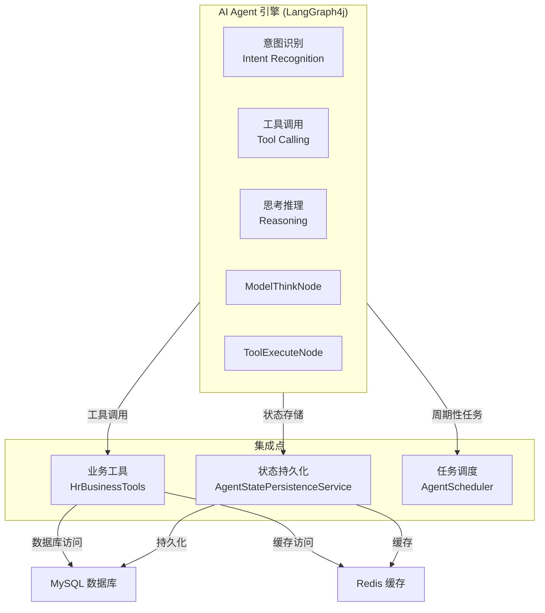

# AI Agent Component Diagrams

This page provides detailed visual diagrams of the AI Agent engine components, focusing on the ReAct loop architecture, agent node responsibilities, and integration points with other system components. These diagrams complement the high-level system architecture and illustrate the detailed structure of the agent's intelligent behavior engine.

## 🔄 ReAct Loop Control Flow Diagram

This diagram illustrates the core ReAct (Reasoning + Acting) loop pattern implemented by the AI Agent engine using LangGraph4j. This is the heart of the system's intelligent behavior.

<!-- openwiki: mermaid parse failed and this diagram was converted to a text fence so it does not break rendering. Fix the diagram source and restore the mermaid fence. Parser error: Parse error on line 3: ...Model ->|有工具调用<br/>(TOOL_CALLS non-empt Expecting 'SQE', 'DOUBLECIRCLEEND', 'PE', '-)', 'STADIUMEND', 'SUBROUTINEEND', 'PIPE', 'CYLINDEREND', 'DIAMOND_STOP', 'TAGEND', 'TRAPEND', 'INVTRAPEND', 'UNICODE_TEXT', 'TEXT', 'TAGSTART', got 'PS' -->
```text
graph LR
    START([开始]) --> Model["ModelThinkNode\nIntent Recognition & LLM Reasoning"]
    Model -->|有工具调用<br/>(TOOL_CALLS non-empty)| Action["ToolExecuteNode\nTool Execution"]
    Model -->|无工具调用<br/>(TOOL_CALLS empty)| END([结束])
    Action -->|结果回填<br/状态更新| Model
    
    %% Loop limit annotation
    style Model fill:#e3f2fd,stroke:#1976d2,stroke-width:2px
    style Action fill:#fff3e0,stroke:#fb8c00,stroke-width:2px
```

### ReAct Loop Details

| 阶段 | 节点 | 职责 |
|------|------|------|
| **模型 (ModelThinkNode)** | Intent Recognition & LLM Reasoning | Writes user messages to session memory, calls LLM reasoning, dynamically injects relevant @Tool specifications filtered by user intent |
| **工具 (ToolExecuteNode)** | Tool Execution | Executes tool calls, fills results as ToolExecutionResultMessage into session memory, clears TOOL_CALLS, returns to model |

The condition edge after model checks if `TOOL_CALLS` is empty: if empty (final answer or error) → END; if non-empty (model still issuing tool requests) → action. The model allows a maximum of `MAX_TOOL_CALLS` (8) iterations per turn to prevent infinite loops.

## 🤖 Agent Node Responsibilities

### ModelThinkNode

**Purpose**: The cognitive engine that processes user queries and determines the next action.

**Key Responsibilities**:
- **Intent Recognition**: Analyzes user input to understand the underlying intent and required operations
- **LLM Reasoning**: Calls the language model to generate responses and tool specifications
- **Tool Filtering**: Dynamically loads and injects only relevant @Tool specifications based on user intent
- **State Management**: Writes user messages to session memory for context preservation
- **Decision Making**: Determines whether tool calls are needed based on `TOOL_CALLS` state

**Control Flow Entry**: ReAct loop start or returns from ToolExecuteNode
**Control Flow Exit**: Ends ReAct loop (if no tools) or proceeds to ToolExecuteNode

### ToolExecuteNode

**Purpose**: The execution engine that performs actions based on tool calls.

**Key Responsibilities**:
- **Tool Invocation**: Executes tool calls generated by ModelThinkNode
- **Result Processing**: Processes and formats tool execution results
- **State Updates**: Fills results as ToolExecutionResultMessage into session memory
- **State Cleanup**: Clears TOOL_CALLS to prepare for next iteration
- **Loop Continuation**: Returns to ModelThinkNode for next reasoning step

**Control Flow Entry**: From ModelThinkNode when tools are called
**Control Flow Exit**: Returns to ModelThinkNode with updated state

## 🏗️ Component Hierarchy Diagram

The following diagram illustrates the top-level component structure of the AI Agent system, showing the separation between agent engine and integration points.



## 🔌 Integration Points

### Tool Integration

The AI Agent integrates with business tools through a dynamic loading strategy:

- **Tool Discovery**: Tools are loaded based on user intent to reduce token consumption
- **Runtime Execution**: ToolExecuteNode handles all tool invocations
- **Result Integration**: Tool results are seamlessly integrated back into the ReAct loop
- **Error Handling**: Tool execution failures are properly managed and reported

**Evidence**: repo://src/main/java/org/example/hragent/agent/tools/HrBusinessTools.java

### State Management Integration

The agent maintains conversation state and persists it for continuity:

- **Session Memory**: In-memory storage for current conversation context
- **Persistent Storage**: Long-term storage via AgentStatePersistenceService
- **State Synchronization**: Integration with backend data stores (MySQL, Redis)
- **State Recovery**: Ability to resume conversations from previous states

**Evidence**: repo://src/main/java/org/example/hragent/agent/persistence/AgentStatePersistenceService.java

### Scheduling Integration

The agent supports scheduled operations and background processing:

- **Task Orchestration**: Integration with AgentScheduler for periodic operations
- **Workflow Coordination**: Synchronization with Flowable workflow engine
- **Resource Management**: Proper resource allocation and cleanup
- **Monitoring**: Integration with system monitoring and logging

**Evidence**: repo://src/main/java/org/example/hragent/agent/graph/AgentScheduler.java

## 🔄 State/Lifecycle Management

### Agent Lifecycle States

1. **Initialization**: Agent starts with empty session memory
2. **Active Processing**: ReAct loop processes user queries
3. **Tool Execution**: Tools are called and results processed
4. **State Persistence**: Session state is saved periodically
5. **Termination**: Agent ends session or continues based on user interaction

### State Invariants

- **Maximum Tool Calls**: Limited to `MAX_TOOL_CALLS` (8) per turn to prevent infinite loops
- **Session Context**: Conversation history is maintained in session memory
- **Tool Availability**: Only relevant tools are loaded based on intent
- **State Consistency**: State changes are atomic and consistent

## ⚙️ Configuration and Operations

### Runtime Configuration

- **Tool Limits**: Maximum number of tool calls per turn (8)
- **Dynamic Loading**: Tool loading strategy based on user intent
- **State Retention**: Configuration for session state persistence duration
- **Error Handling**: Retry policies and error recovery mechanisms

### Operational Behavior

- **Request Processing**: HTTP requests are routed through AgentController
- **Response Streaming**: Real-time responses via SSE (Server-Sent Events)
- **Performance Monitoring**: Metrics collection for agent performance
- **Resource Management**: Proper cleanup of resources and connections

**Evidence**: repo://src/main/java/org/example/hragent/agent/controller/AgentController.java

## 📊 Testing and Validation

### Unit Testing

- **Node Testing**: Individual node (ModelThinkNode, ToolExecuteNode) testing
- **Integration Testing**: Tool integration and state management testing
- **ReAct Loop Testing**: Complete loop behavior validation
- **Performance Testing**: Tool call limit and resource consumption testing

### End-to-End Testing

- **User Journey Testing**: Complete user interaction flows
- **Error Scenario Testing**: Tool failure and error handling validation
- **Load Testing**: System performance under concurrent requests
- **State Consistency Testing**: Conversation continuity and state recovery

## 🔧 Extension Points

### Custom Tool Development

- **Tool Interface**: Extension point for adding new business tools
- **Tool Registration**: Dynamic tool discovery and registration
- **Tool Classification**: Intent-based tool categorization
- **Tool Testing**: Tool-specific validation and testing

### Custom Node Development

- **Node Extension**: Point for adding custom agent nodes
- **Custom Logic**: Integration of custom reasoning and execution logic
- **State Management**: Extension of state management capabilities
- **Control Flow**: Custom control flow and routing logic

## 📈 Performance Characteristics

### Scalability Factors

- **Tool Loading**: Dynamic loading reduces memory footprint
- **State Management**: Efficient session handling supports concurrent users
- **Resource Limits**: Tool call limits prevent resource exhaustion
- **Caching**: Redis integration improves performance for repeated operations

### Latency Considerations

- **Tool Execution**: Parallel tool execution where possible
- **State Persistence**: Efficient state save/restore mechanisms
- **Network I/O**: Minimized through intelligent tool loading
- **Processing Overhead**: LLM reasoning is the primary latency factor

## 🔍 Debugging and Monitoring

### observability Features

- **State Tracking**: Session state monitoring and debugging
- **Tool Execution Logs**: Detailed logs of tool calls and results
- **Performance Metrics**: Response times and tool call statistics
- **Error Tracking**: Comprehensive error reporting and analysis

### Debugging Capabilities

- **State Inspection**: Real-time state viewing and modification
- **Tool Testing**: Individual tool execution in isolation
- **ReAct Loop Debug**: Step-by-step loop execution visualization
- **Integration Testing**: Component interaction validation

This diagram and documentation provides a comprehensive view of the AI Agent component's architecture, control flow, integration points, and operational characteristics. The ReAct loop pattern ensures intelligent, efficient, and maintainable agent behavior while providing clear extension points for future enhancements.
