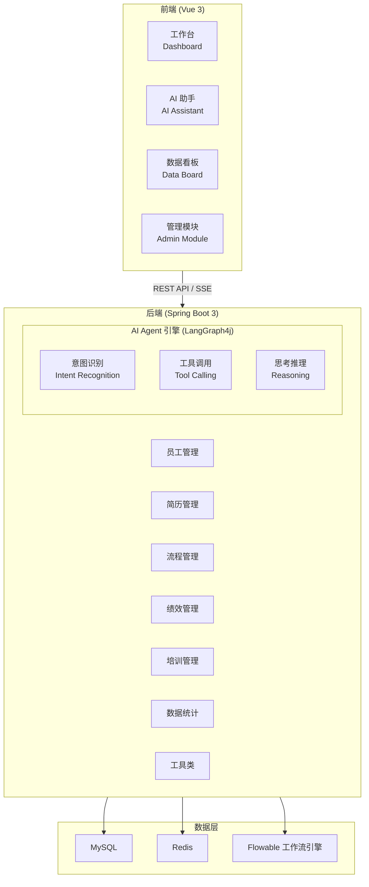
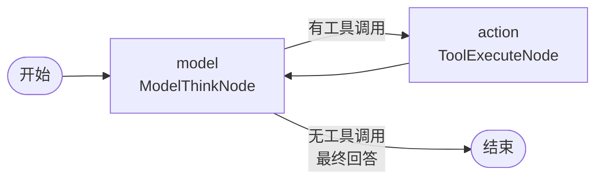

# System Architecture Overview

## 整体架构图

The HR Agent system is a full-stack HR management application built on a Spring Boot backend with a Vue 3 frontend. The architecture follows a layered design with clear separation between presentation, business logic, and data persistence.



## 核心模块说明

### AI Agent 引擎

The AI Agent engine is a state-machine-driven system built on LangChain4j + LangGraph4j. It implements a ReAct (Reasoning + Acting) loop pattern for multi-step tool orchestration.



| 节点 | 职责 |
|------|-------|
| **model (ModelThinkNode)** | Writes user messages to session memory, calls LLM reasoning, dynamically injects relevant @Tool specifications filtered by user intent |
| **action (ToolExecuteNode)** | Executes tool calls, fills results as ToolExecutionResultMessage into session memory, clears TOOL_CALLS, returns to model |

The condition edge after model checks if `TOOL_CALLS` is empty: if empty (final answer or error) → END; if non-empty (model still issuing tool requests) → action. The model allows a maximum of `MAX_TOOL_CALLS` (8) iterations per turn to prevent infinite loops.

Tool chains use a **dynamic loading** strategy, loading only relevant tools based on user intent to reduce token consumption.

### 工作流引擎

Based on Flowable BPMN 2.0, supporting:

- 入职审批流程 (Onboarding)
- 离职审批流程 (Offboarding)
- 调岗审批流程 (Transfer)
- 转正审批流程 (Probation completion)

### 数据看板

Provides system-level data statistics and visualization, including:

- AI 交互统计 (对话量、Token 消耗、工具调用)
- 业务概览 (员工、简历、流程、绩效)
- 每日趋势分析
- 最近活动日志

## 安全设计

- 敏感字段 (手机号、身份证、工资) AES-256-CBC 加密存储
- 防重复提交 (Redis SETNX + 3 秒 TTL)
- 接口限流 (2 次 / 5 秒)
- 分布式锁 (Redisson RLock)

## 部署与运维

### Infrastructure Prerequisites

| Service | Version | Default Port | Container Name | Purpose |
|---------|---------|-------------|----------------|---------|
| MySQL | 5.7+ | 13306 | `douban-mysql` | Business database (`hr_agent_db`) |
| Redis | 6.2+ | 16379 | `douban-redis` | Caching and distributed locking |

Other optional services (RabbitMQ, Elasticsearch, object storage) are configured in `application.yaml` but are not required for core functionality.

### Backend Deployment

`src/main/java/org/example/hragent/HrAgentApplication.java` is the single entrypoint annotated with `@SpringBootApplication`, `@EnableCaching`, and `@EnableAspectJAutoProxy`.

```bash
mvn clean package -DskipTests
java -jar target/hr-agent-0.0.1-SNAPSHOT.jar
```

Backend listens on port `8080`. HikariCP is used for the database connection pool with default settings. Redis caching is enabled via `@EnableCaching` with configurable TTL.

### Required Environment Variables

| Variable | Required | Default | Description |
|----------|----------|---------|-------------|
| `AI_API_KEY` | Yes | — | AI model API key |
| `AI_BASE_URL` | No | Aliyun MaaS endpoint | AI service base URL |
| `AI_MODEL_NAME` | No | `deepseek-v4-flash-0731` | Model name |
| `MAIL_PASSWORD` | No | — | QQ SMTP authorization code for onboarding email |
| `COS_ACCESS_KEY` / `COS_SECRET_KEY` | No | — | Object storage for resume files |
| `ALIYUN_OCR_ACCESS_KEY_ID` / `ALIYUN_OCR_ACCESS_KEY_SECRET` | No | — | Aliyun OCR for scanned resume parsing |

### Frontend Deployment

- **Framework**: Vue 3 (TypeScript)
- **Build Tool**: Vite
- **API Communication**: REST API / Server-Sent Events (SSE)

```bash
cd frontend
npm install
npm run build
```

Production artifact is written to `frontend/dist/`. `vite.config.ts` configures the development proxy to forward `/api` requests to `http://localhost:8080`.

## Database Schema

The schema defines 14 business tables in `src/main/resources/sql/init_schema.sql`:

- `t_employee` — employee records with role-based access (EMPLOYEE, DEPT_LEADER, HR, HRBP, ADMIN)
- `t_job_post` — recruitment positions
- `t_resume` — candidate resumes with AI-parsed structured JSON
- `t_flow_instance` — business process instances binding to Flowable engine
- `t_flow_approval` — approval records for business processes
- `t_performance` — employee performance records
- `t_training_course` — training course catalog
- `t_ability_tag` — skill tag dictionary for resume matching
- `t_resume_ability_rel` — many-to-many resume-to-tag relationships
- `t_sys_file` — file metadata for object storage references
- `t_agent_session` — AI agent conversation sessions
- `t_agent_message` — conversation message history
- `t_agent_tool_log` — tool invocation logs
- `t_agent_interact_log` — per-turn AI interaction statistics

All tables share the BaseEntity contract: `id`, `create_time`, `update_time`, `delete_time`, and `is_deleted` (logical delete flag).

Flowable engine tables (`ACT_*`) are not in the init script. The engine creates them automatically on first boot because `flowable.database-schema-update` is set to `true` in `application.yaml`.
