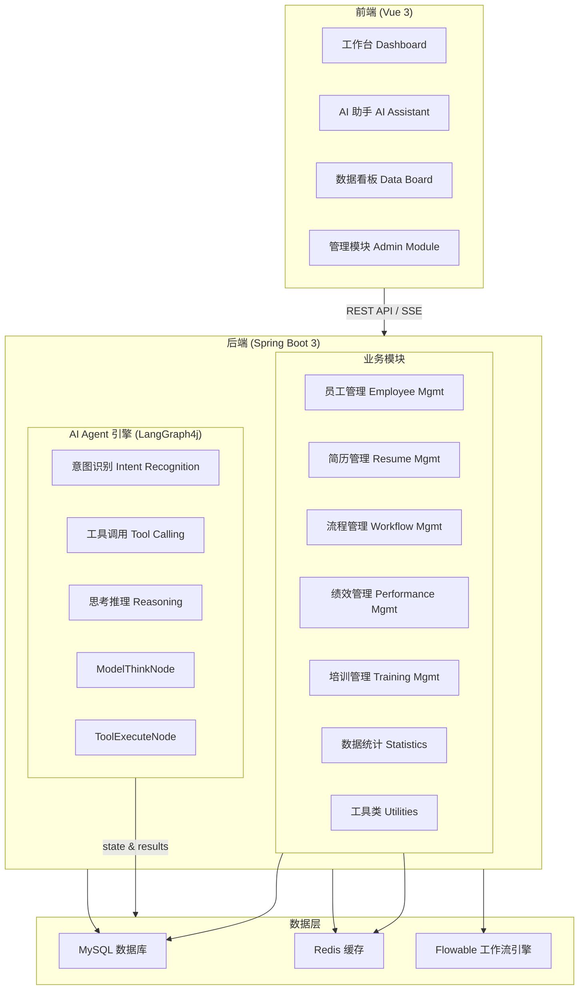
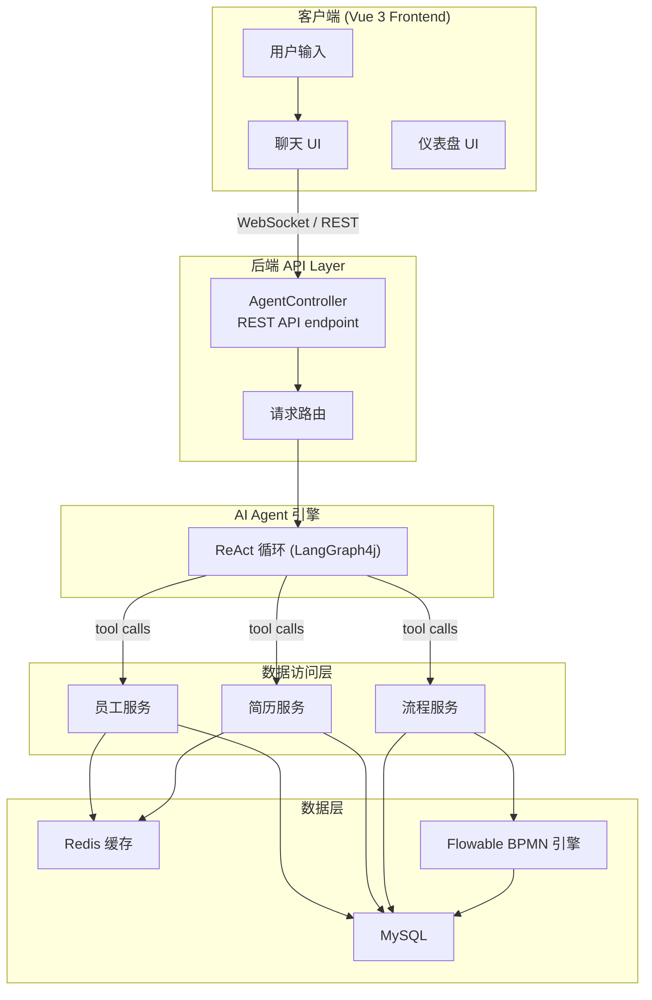
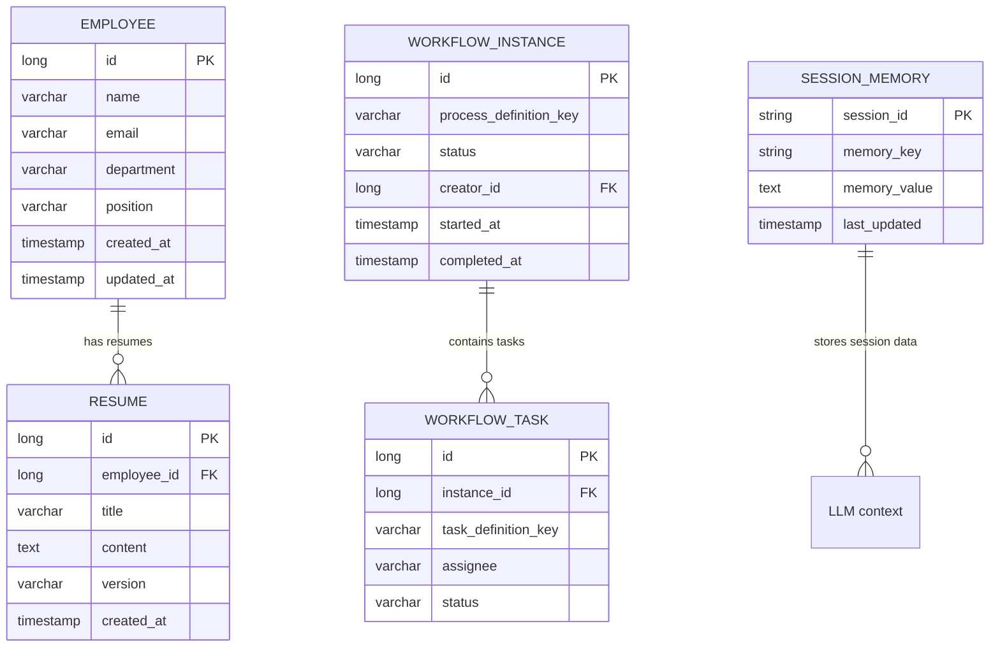
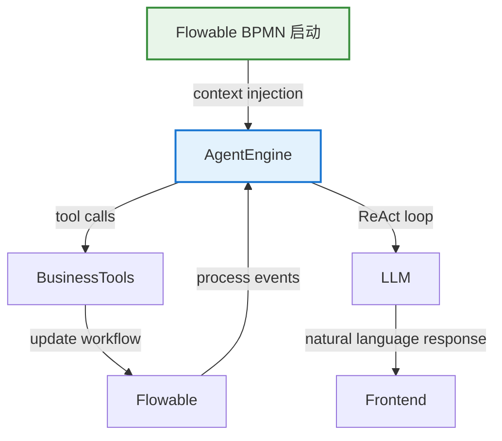

# Component and Data Diagrams

This page provides visual diagrams of the HR Agent system's components, data flows, and architectural patterns. These diagrams complement the high-level system architecture overview and illustrate the detailed structure of the system's modules, agent engine, and integration points.

## 📊 Component Hierarchy Diagram

The following diagram illustrates the top-level component structure of the HR Agent system, showing the separation between frontend, backend, and data layer components.



## 🔄 ReAct Loop Control Flow Diagram

This diagram illustrates the core ReAct (Reasoning + Acting) loop pattern implemented by the AI Agent engine using LangGraph4j. This is the heart of the system's intelligent behavior.

<!-- openwiki: mermaid parse failed and this diagram was converted to a text fence so it does not break rendering. Fix the diagram source and restore the mermaid fence. Parser error: Parse error on line 3: ...Model ->|有工具调用<br/>(TOOL_CALLS non-empt Expecting 'SQE', 'DOUBLECIRCLEEND', 'PE', '-)', 'STADIUMEND', 'SUBROUTINEEND', 'PIPE', 'CYLINDEREND', 'DIAMOND_STOP', 'TAGEND', 'TRAPEND', 'INVTRAPEND', 'UNICODE_TEXT', 'TEXT', 'TAGSTART', got 'PS' -->
```text
graph LR
    START([开始]) --> Model["ModelThinkNode<br/>Intent Recognition & LLM Reasoning"]
    Model -->|有工具调用<br/>(TOOL_CALLS non-empty)| Action["ToolExecuteNode<br/>Tool Execution"]
    Model -->|无工具调用<br/>(TOOL_CALLS empty)| END([结束])
    Action -->|结果回填<br/state update| Model
    
    %% Loop limit annotation
    style Model fill:#e3f2fd,stroke:#1976d2,stroke-width:2px
    style Action fill:#fff3e0,stroke:#fb8c00,stroke-width:2px
```

### ReAct Loop Details

| 阶段 | 节点 | 职责 |
|------|------|------|
| **Model Phase** | ModelThinkNode | Writes user messages to session memory, calls LLM reasoning, dynamically injects relevant @Tool specifications filtered by user intent |
| **Action Phase** | ToolExecuteNode | Executes tool calls, fills results as ToolExecutionResultMessage into session memory, clears TOOL_CALLS, returns to model |
| **Loop Control** | Condition edge | Checks if `TOOL_CALLS` is empty: if empty → END (final answer or error); if non-empty → action. Maximum of `MAX_TOOL_CALLS` (8) iterations per turn. |

## 📡 API Flow Diagram

This diagram shows the request flow from frontend to backend and data layer interactions.



## 🗄️ Data Flow Diagram (Entity Relationships)

This diagram illustrates the key data entities and their relationships across the system's data layer.



### Entity Descriptions

| 实体 | 说明 | 主要使用方 |
|------|------|-----------|
| **EMPLOYEE** | 基础员工信息表 | HR 管理模块, AI 工具 |
| **RESUME** | 员工简历记录 | 招聘模块, AI 分析工具 |
| **WORKFLOW_INSTANCE** | Flowable 工作流实例 | 审批流程 (onboarding, offboarding, transfer, probation) |
| **WORKFLOW_TASK** | 具体任务节点 | 流程审批任务分配 |
| **SESSION_MEMORY** | LLM 对话会话内存 | AI Agent ReAct 循环, LangGraph4j state |

## ⚙️ Agent Node Responsibilities Matrix

This matrix provides a detailed view of each AI agent node's responsibilities, entry points, and integration boundaries.

| 节点 | 位置 | 技术栈 | 职责 | 入口点 | 状态管理 | 生命周期 |
|------|------|--------|------|--------|----------|----------|
| **ModelThinkNode** | `org.example.hragent.agent.nodes.ModelThinkNode` | LangChain4j + LangGraph4j | 意图识别, LLM 推理, 动态工具加载, 会话内存写入 | AgentController 接收用户输入 | SessionMemory (Redis-backed) | ReAct 循环每轮迭代, 最多 8 次工具调用 |
| **ToolExecuteNode** | `org.example.hragent.agent.nodes.ToolExecuteNode` | LangChain4j + DefaultToolExecutor | 工具调用执行, 结果填充到会话内存, TOOL_CALLS 清除 | ModelThinkNode 触发工具调用 | SessionMemory (Redis-backed) | 单次执行, 完成后返回 ModelThinkNode |
| **AgentScheduler** | 调度协调 | Flowable BPMN + LangGraph4j | 工作流与 agent 循环集成, 流程启动时的上下文注入 | Flowable 事件监听器 | Flowable process variables | 与 Flowable 流程绑定, 长时间运行 |

## 🔧 Integration Points

### AI Agent ↔ Workflow Engine Integration



### Key Integration Details

| 集成点 | 方向 | 说明 | 同步/异步 |
|--------|------|------|-----------|
| **Flowable → Agent** | BPMN 事件 → Agent | 当 Flowable 流程启动或任务创建时, 上下文注入到 Agent 会话 | 同步 |
| **Agent → Flowable** | Agent tool calls | 工具调用可触发 Flowable 流程操作 (如: 启动审批, 任务分配) | 异步 |
| **Agent ↔ LLM** | ReAct loop | 自然语言交互, 工具决策 | 同步 (每轮) |
| **Agent ↔ Redis** | Session memory | 对话状态, 工具结果缓存 | 同步 |
| **Agent ↔ MySQL** | 持久化 | 业务数据持久化, 工作流实例状态 | 异步 |

## 🛠️ Configuration & Operations

### Agent Configuration Parameters

| 参数 | 默认值 | 说明 | 可配置范围 |
|------|--------|------|------------|
| `MAX_TOOL_CALLS` | `8` | ReAct 循环最大工具调用次数, 防止无限循环 | 1-20 |
| `TOOL_CALL_TIMEOUT_SECONDS` | `30` | 单个工具调用的超时时间 | 5-300 |
| `SESSION_TTL_MINUTES` | `30` | 会话内存的 TTL (Redis) | 5-1440 |
| `DYNAMIC_TOOL_LOADING` | `true` | 是否根据意图动态加载相关工具 | true/false |
| `LLM_MODEL_NAME` | `default` | 使用的 LLM 模型名称 | model configuration |

### Extension Points

| 扩展边界 | 说明 | 实现方式 |
|----------|------|----------|
| **新工具添加** | 添加新的业务工具到 `HrBusinessTools` | 实现 `Tool` 接口, 注册到 Spring Context |
| **自定义 ReAct 变体** | 修改循环控制逻辑 | 自定义 `StateGraph` 配置, 修改条件边 |
| **工作流流程扩展** | 添加新的 BPMN 流程定义 | 创建新的 Flowable BPMN 文件, 部署到引擎 |
| **前端页面集成** | 新增 UI 页面或模块 | Vue 3 组件, 连接后端 REST API |
| **数据持久化自定义** | 自定义仓库或查询 | 扩展 `JpaRepository` 或编写自定义查询 |

## 🧪 Focused Tests

### ReAct Loop Unit Tests

The ReAct loop behavior is verified through the following test scenarios:

| 测试用例 | 目的 | 关键断言 |
|----------|------|----------|
| **Single-turn no-tool** | 验证无工具调用时的正常结束 | `TOOL_CALLS` 为空, 状态 → END |
| **Multi-turn tool chain** | 验证多轮工具调用的正确累积 | 结果在每轮累积, 第 8 轮仍有调用 → 异常终止 |
| **Tool execution failure** | 验证工具执行失败的错误处理 | 错误结果填入内存, 循环继续或结束取决于错误类型 |
| **Dynamic tool filtering** | 验证意图感知的工具加载 | 只加载相关工具, 无关工具被过滤剔除 |
| **Flowable integration** | 验证工作流上下文的注入和持久化 | Flowable 变量正确设置, 状态持久化正确 |

### Integration Test Suites

| 测试套件 | 范围 | 关键验证 |
|----------|------|----------|
| **AI Agent End-to-End** | 完整 ReAct 循环 + 工具调用 + Flowable 集成 | 自然语言查询 → 工具执行 → 流程操作 → 响应返回 |
| **Workflow Process Tests** | Onboarding/offboarding/transfer/probation 流程 | BPMN 实例创建 → 任务分配 → 审批完成 → 状态更新 |
| **Session Management Tests** | Redis 会话的 CRUD 和 TTL | 会话创建 → 数据写入 → TTL 超时 → 自动清理 |

---

*Document generated as part of the HR Agent system architecture documentation. For additional context, see the [System Architecture Overview](/openwiki/architecture/architecture.md) and [AI Agent Engine Integration](/openwiki/integrations/ai-agent-integration.md) pages.*
