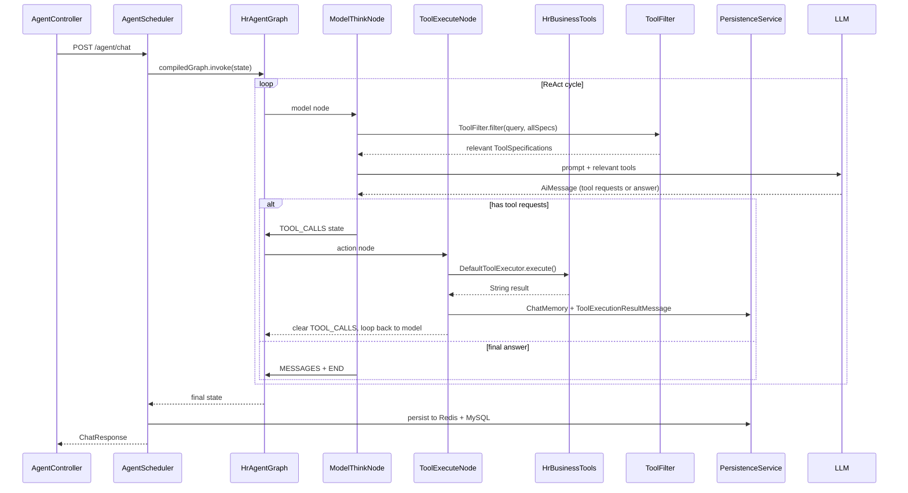

# Business Tools Architecture

The HR Agent's business tools layer sits between the LLM and the HR domain services. It exposes 20 `@Tool`-annotated methods in a single Spring `@Component`, a keyword-based dynamic filter narrows the tool set per user query before it reaches the model, and the LangGraph4j ReAct loop wires model thinking and tool execution into a state-machine graph.

## Tool Set Overview

`HrBusinessTools` (`repo://src/main/java/org/example/hragent/agent/tools/HrBusinessTools.java`) is the sole tool provider. Every HR operation the agent can perform is a `@Tool` method on this class:

| Category | Tools | Count |
|----------|-------|-------|
| 员工 (Employee) | `queryEmployeeInfo`, `queryEmployeeList` | 2 |
| 简历 (Resume) | `queryResumeInfo`, `queryResumeMatch`, `registerCandidate`, `acceptCandidate`, `startOnboardingProcess` | 5 |
| 流程 (Flow) | `startResignationProcess`, `startTransferProcess`, `queryProcessInstances`, `queryProcessTrace`, `queryMyTodoTasks`, `completeApprovalTask` | 6 |
| 岗位 (Job) | `queryJobInfo`, `queryJobList` | 2 |
| 绩效 (Performance) | `queryPerformanceResult`, `generatePerformanceReport` | 2 |
| 培训 (Training) | `generateTrainingPlan`, `queryTrainingCourses` | 2 |
| 知识 (Knowledge) | `hrKnowledgeQA` | 1 |

Total: 20 tools. Each `@Tool` annotation carries a Chinese-language description that the LLM uses to decide when to call the tool. All methods return plain `String` — structured data is formatted inline (e.g., `formatEmployeeInfo`, `formatJobInfo`), and errors are caught per-method and returned as user-facing error strings rather than thrown.

## How Tools Are Wired to the Agent Graph

The agent graph lives in `HrAgentGraph` (`repo://src/main/java/org/example/hragent/agent/graph/HrAgentGraph.java`) and implements a ReAct loop:

Key wiring details:

- `ModelThinkNode` (`repo://src/main/java/org/example/hragent/agent/nodes/ModelThinkNode.java`) calls `ToolSpecifications.toolSpecificationsFrom(hrBusinessTools)` once at construction to extract all `@Tool` metadata, then passes the list through `ToolFilter.filter(userQuery, allToolSpecifications)` before each LLM call.
- `ToolExecuteNode` (`repo://src/main/java/org/example/hragent/agent/nodes/ToolExecuteNode.java`) uses `DefaultToolExecutor` from LangChain4j to reflectively invoke the matching `@Tool` method on `HrBusinessTools` by name, then writes `ToolExecutionResultMessage` back into the session's `ChatMemory`.
- `HrAgentState` (`repo://src/main/java/org/example/hragent/agent/state/HrAgentState.java`) carries `toolCalls` (base channel, last-wins) and `iteration` between nodes; `MAX_TOOL_CALLS = 8` guards against infinite loops.
- `ToolCallRecord` (`repo://src/main/java/org/example/hragent/agent/state/ToolCallRecord.java`) is a serializable record wrapping `ToolExecutionRequest.id/name/arguments` — LangGraph4j clones state between nodes via Java serialization, so the non-serializable LangChain4j request object must be decomposed.

## Dynamic Tool Filtering

`ToolFilter` (`repo://src/main/java/org/example/hragent/agent/tools/ToolFilter.java`) is the token-optimization layer. Without it, all 20 tool specifications would be injected into every LLM prompt. Instead:

1. The user query is scanned for category keywords defined in `CATEGORY_KEYWORDS` (e.g., "员工", "简历", "流程", "岗位", "绩效", "培训", "知识").
2. Matching categories determine which tools are included via `TOOL_CATEGORIES` mapping (tool name → set of categories).
3. **Safety fallback**: if no category matches, all tools are returned so the model never lacks capability.
4. **Employee auto-inclusion**: whenever a non-"员工" category is matched, the "员工" category is automatically added, since most operations need employee lookups.

This keeps the tool list tight — a query about "入职流程" matches only 流程 + 自动附带的员工 tools (7 tools instead of 20).

## Session Memory & Lifecycle

`HrAgentAiServiceFactory` (`repo://src/main/java/org/example/hragent/agent/tools/HrAgentAiServiceFactory.java`) manages `ChatMemory` per session using a `ConcurrentHashMap<Long, ChatMemory>` with `MAX_MESSAGES = 40` (≈20 rounds of dialogue). It provides:

- `getChatMemory(Long sessionId)` — lazy-create or retrieve session memory
- `clearSession(Long sessionId)` — remove memory on session end

The `chatMemoryId` is derived from the session ID via a hash function in `AgentScheduler.generateChatMemoryId` (`repo://src/main/java/org/example/hragent/agent/graph/AgentScheduler.java`).

## Persistence

`AgentStatePersistenceService` (`repo://src/main/java/org/example/hragent/agent/persistence/AgentStatePersistenceService.java`) stores agent state in two tiers:

- **Redis** — fast state存取 for LangGraph workflow cloning (TTL 24h)
- **MySQL** — session metadata (`t_agent_session`), message history (`t_agent_message`), and tool call logs (`t_agent_tool_log` via `AgentToolLog` entity)

The `AgentToolLog` entity records `sessionId`, `messageId`, `intentCode`, `toolName`, `inputParams`, `outputResult`, `status` (success/error/timeout), `durationMs`, and `errorMessage`.

## Extensibility: Adding a New Tool

To add a new HR business tool:

1. **Add a `@Tool` method to `HrBusinessTools`** — follow the existing pattern: accept a `String query` parameter, return a `String`, catch all exceptions internally, and add a Chinese description in the annotation.
2. **Register the tool category mapping in `ToolFilter`** — add an entry to `TOOL_CATEGORIES` with the tool method name and its category set (e.g., `Set.of("员工")`).
3. **Add category keywords if needed** — if the new tool belongs to a new category, add a `CATEGORY_KEYWORDS` entry.
4. **No other wiring needed** — `ModelThinkNode` discovers tools via `ToolSpecifications.toolSpecificationsFrom(hrBusinessTools)` at construction time, and `ToolExecuteNode` uses `DefaultToolExecutor` to resolve by name at runtime.

## Failure Handling

- **Tool method errors**: caught inside each `@Tool` method, returned as `"出错：" + e.getMessage()` strings — the agent sees a normal result, not an exception.
- **Tool execution errors**: caught in `ToolExecuteNode.execute()`, returned as `"执行失败：" + e.getMessage()`.
- **Model inference errors**: caught in `ModelThinkNode.apply()`, routed to `error()` which writes an error message to state and clears tool calls.
- **AgentScheduler**: wraps the entire workflow in try/catch; failures return a `ChatResponse` with the error string rather than propagating exceptions to the HTTP layer.

## Tests

The existing test suite (`repo://src/test/java/org/example/hragent/HrAgentApplicationTests.java`) contains only a `contextLoads()` smoke test. There are no dedicated unit tests for `HrBusinessTools`, `ToolFilter`, or the agent graph nodes. Testing the tool system requires integration tests that exercise the full `AgentScheduler → HrAgentGraph → ModelThinkNode/ToolExecuteNode` chain against a running Spring context with Redis and MySQL.
