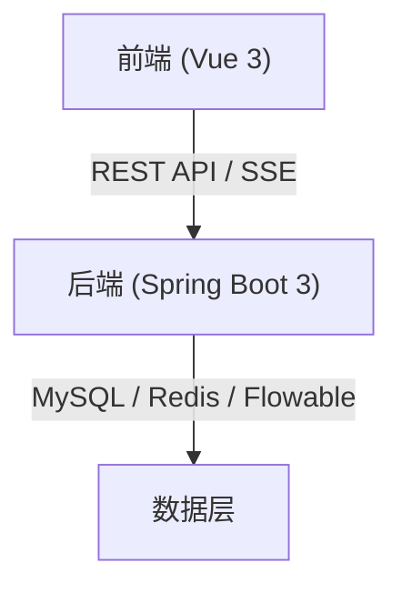
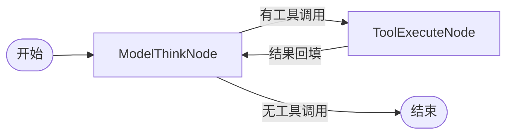

# AI Agent Engine Integration

## Overview

The AI Agent engine is the core intelligent layer of the HR system, built on **LangChain4j + LangGraph4j**. It implements a state-machine-driven ReAct (Reasoning + Acting) loop pattern for multi-step tool orchestration. The agent integrates tightly with the **Flowable BPMN 2.0** workflow engine to manage business processes while leveraging LLM-based reasoning for natural language interactions.

## Architecture Overview

### Key Components

| Component | Technology | Role |
|-----------|------------|------|
| **AI Agent Engine** | LangChain4j + LangGraph4j | State-machine-driven agent with ReAct loop |
| **Workflow Engine** | Flowable BPMN 2.0 | Manages business processes (onboarding, offboarding, transfer, probation) |
| **Data Layer** | MySQL, Redis, Flowable | Persistent storage for sessions, states, and workflow instances |
| **Frontend** | Vue 3 | User interface for chat, dashboards, and admin modules |

## Agent Nodes & Responsibilities

### 1. Model Think Node (Intent Recognition)

- **Location**: `org.example.hragent.agent.nodes.ModelThinkNode`
- **Role**: First node in the ReAct loop. Performs:
  - Analyzes user input and extracts intent + parameters
  - Writes user messages to session memory (ChatMemory)
  - Calls the LLM (ModelThink) to reason and decide whether to call tools
  - Dynamically filters and loads only relevant tools based on intent (dynamic tool loading)
- **Key Behavior**: Maximum of 8 tool calls per conversation turn to prevent infinite loops

### 2. Tool Execute Node (Tool Calling)

- **Location**: `org.example.hragent.agent.nodes.ToolExecuteNode`
- **Role**: Second node in the ReAct loop. Executes tool calls and manages results:
  - Consumes tool calls from the state (TOOL_CALLS key)
  - Uses `DefaultToolExecutor` to invoke business tools defined in `HrBusinessTools`
  - Stores tool execution results in session memory as `ToolExecutionResultMessage`
  - Clears the TOOL_CALLS list after execution, allowing the next reasoning cycle
- **Key Behavior**: Processes tool calls sequentially, accumulates results, and feeds them back to the model for continued reasoning

### 3. Reasoning Loop (Flowable Integration)

- **Technology**: Flowable BPMN 2.0
- **Integrated Processes**:
  - **入职审批** (Onboarding)
  - **离职审批** (Offboarding)
  - **调岗审批** (Transfer)
  - **转正审批** (Probation completion)
- **Integration Pattern**: The AI agent acts as the orchestrator within Flowable flows. When a process starts in Flowable, the agent receives the initial context and can extend the workflow by calling additional tools or triggering further actions.

## Workflow Integration Details

### ReAct Loop (LangGraph4j)

The agent follows a ReAct pattern implemented via LangGraph4j's state machine:

- **Model Phase**: LLM generates responses, decides whether to call tools, and adds tool specifications to the context.
- **Action Phase**: Tools are executed, results stored in session memory, and the state transitions back to the model.
- **Termination**: When no more tool calls are pending, the agent produces a final answer.

### Dynamic Tool Loading

To optimize token usage, the system employs **dynamic tool loading**:
- Based on user intent, only relevant tools are loaded (e.g., employee queries load 2 tools, resume management loads 4 tools, process approval loads 7 tools).
- This reduces unnecessary tool invocations and keeps conversations efficient.

## Entry Points & Configuration

### API Endpoints

All agent interactions are exposed through the `AgentController` REST API at `/agent`:

| Method | Path | Description |
|--------|------|-------------|
| POST | `/chat` | Process a single message (requires rate limiting) |
| POST | `/chat/{sessionId}` | Continue an ongoing conversation |
| DELETE | `/session/{sessionId}` | Clear a specific session |
| GET | `/sessions` | List all active sessions for the current user |
| GET | `/session/{sessionId}/messages` | Retrieve message history for a session |

### Security & Rate Limiting

- **Rate Limit**: 5 requests per 10 seconds (`@RateLimit`)
- **Repeat Submit Protection**: 3-second cooldown during active processing (`@RepeatSubmit`)
- **Anti-duplicate**: Redis SETNX + 3-second TTL prevents duplicate submissions
- **Throttling**: Interface limits (2 requests / 5 seconds) protect downstream services

### State Management

- **Session Storage**: Persisted in both Redis (fast lookup) and MySQL (durable storage)
- **State Keys**:
  - `TOOL_CALLS`: List of tool call requests waiting for execution
  - `TOOL_CALLS_KEY`: Empty after tool execution
  - `TOOL_RESULTS_KEY`: Summary of tool execution outcomes
  - `CHAT_MEMORY_ID`: Unique identifier for session chat memory

## Data Flow

1. **User Input** → `/agent/chat` endpoint
2. **AgentScheduler** processes the message through the LangGraph4j workflow
3. **ModelThinkNode** analyzes intent, selects tools, and generates reasoning
4. **ToolExecuteNode** executes selected tools and stores results
5. **State Persistence** saves updated state to Redis/MySQL
6. **Response** is returned to the client with thinking process and final answer

## Extensibility Points

- **New Tools**: Added to `HrBusinessTools` and registered with `ToolFilter`
- **New Intents**: Configured in `ModelThinkNode` via `ToolFilter`
- **New Processes**: Implemented as Flowable BPMN activities and called from the agent
- **Custom Models**: Can be swapped by providing alternative `ChatLanguageModel` implementations

## Relation to Other Pages

- **Architecture**: `/openwiki/architecture/architecture.md` – describes the overall system layout
- **Flowable Workflow**: `/openwiki/operations/deployment.md` – deployment details for Flowable
- **Agent Module**: `/docs/modules/agent.md` – broader module documentation
- **Source Code**: `/src/main/java/org/example/hragent/agent/` – implementation details

## Summary

The AI Agent engine serves as the intelligent orchestrator that bridges natural language user requests with concrete business operations. Through LangGraph4j's state machine and Flowable's BPMN workflows, it handles everything from simple queries to complex multi-step processes like onboarding and offboarding, all while maintaining efficiency through dynamic tool loading and strict rate limiting.
